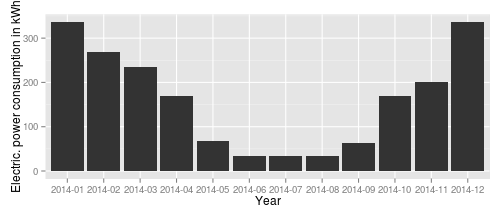

 

## Slide 1 Concept of a geothermal heat pump

A geothermal heat pump takes geothermal energy (e.g. from the ground of a building)
to produce the heat required for the heating and the warm water of a house.

The idea is to pump a fluid in the ground which evaporates by the geothermal heat
of the ground (adiabtic state change). 

The heat pump transforms the gas into a liquid again
using a compressor and reuses the heat energy which is produced in this process step. 

Electrical energy is to run the components of the heat pump e.g. the motors of the pumps and the compressor.

---

## Slide 2
Important parameters of a heat pump are the heat produced, the electrical energy consumed and the costs which can be used to evaluate the efficiency of the heat pump. 

A heat pump runs efficiently if it produces three parts heat energy (75% heat energy) for one part electrical energy (25% electrical energy). Look at the following example of 2014.


```r
data <- read.csv("/home/luke/consumption1.csv", sep = ",", header = T, skip = 1)
```


```r
res <- sqldf("select substr(Date, 1, 7) as Date, (HeatProduction/4) as HeatProduction from data where Date like '2014%' order by Date")
ggplot(res, aes(x = Date, y = HeatProduction)) + geom_bar(stat = "identity") + 
    labs(x = "Year", y = "Electric. power consumption in kWh")
```

 

```r
# + geom_hline(aes(yintercept=mean(HeatProduction), colour='red')
```


---

## Slide 3 The Shiny app
My shiny application takes data from the heat energy of the heat pump of my house to:

1. present an overview of the heat energy in kWh produced heat pump as a bar plot. Moreover the
mean off the heat energy is presented.

2. present on overview of the electrical overview of the electrical energy that should be consumed by the heat pump in a barplot. This can be used to check if the heat pump runs efficiently comparing the values of the separate power meter. Once again the mean is calculated.

3. get economical overview of the costs that are optimal to compare them with the bills of the electrcal poer provider. Input about the current costs is provided by the slider. Energy prices per kWh vary from 23 cent to 28 cent for a heat pump in Germany.

---

## Slide 4 Summary Future work
This presentations describes the principles and the functionality of an app showing various geothermal heat pump parameters.

My shiny application can be improved as future work to predict the consumption and production of energy and the costs. 

This extension could be based on machine learning techniques.

Functional extension would be a larger project requiring also more data.

---


